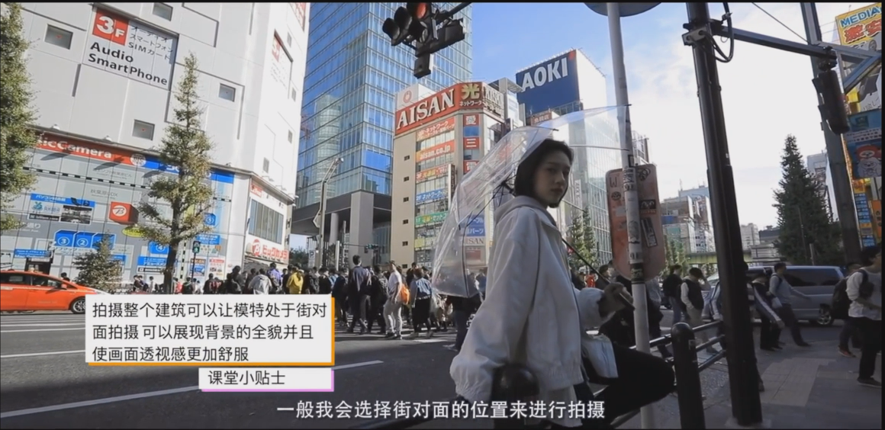

## 背景

时间：上午十点

地点：日本街头

## 技巧

好的审美就是控制和选择一张照片中元素的能力，这张照片中的元素既包括我们的环境、背景、光线。在人像拍摄当中也包括出现在照片当中端的人物以及服装、化妆、道具。同时在嘈杂的环境中，还要学会筛选和摒弃不想要的元素

1、画面中各种元素的选择，模特服装搭配与背景元素的颜色构成要形成统一，环境白色比较多，人物也可以选择白色的衣服

2、摆姿要与自己想拍的主题相符，提前与模特沟通清楚主题

3、选择人少的地方比较适合快速出片

4、找长街或有纵向延伸的场景构图可以有效提升画面纵深感

5、在阳光直射或者处于顶光时，可以选择阴影处拍摄，可以更好的控制光线。并且街角处可以避免干扰性的元素

6、使用与背景相关的小道具，增添画面中的元素

7、特写中要注意后景中的元素和前景的统一性，前后景的正确搭配可以有效增加照片层次感

8、寻找构图中增加画面延伸感的场景，不同的集合线条元素组合给人以冲击力。比如人行横道斑马线，配上广角度，会更加有冲击力。可以使用动静结合，拍摄人群中动态照片时，让模特提前走上前与人群形成对比

9、过街时，让模特走在斑马线的边缘，摄影师与模特处于同一水平线拍摄，增加画面纵深感。过街时可以选择对称构图，让画面更加有气势。需要提前沟通好，让她以一种非常非常自信的神态出现在镜头前

10、寻找逆光拍摄，可以为模特生成好看的轮廓光与柔和平均的面光。可以使用透明雨伞作为道具。

11、拍摄整个建筑和模特时，可以让模特在建筑的街道对面，可以更好的展现建筑的全貌，并且是画面透视感更加舒服

12、寻找场景中的玻璃或者通透的道具当作前景拍摄。比如：电话亭，咖啡馆、酒店的房间里，有任何玻璃橱窗的环境下

环境中杂乱元素处理方法：大光圈的镜头，拍摄角度，比如仰拍可以处理到路上的行人。