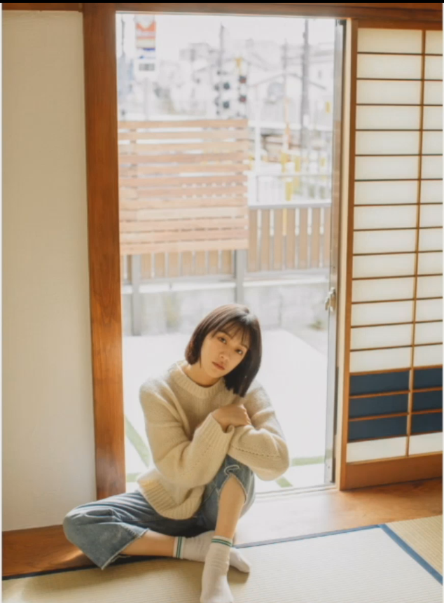
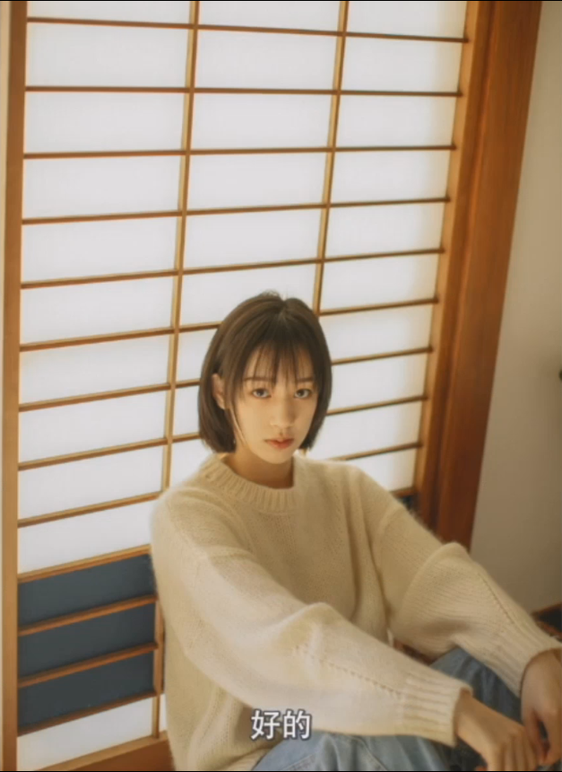
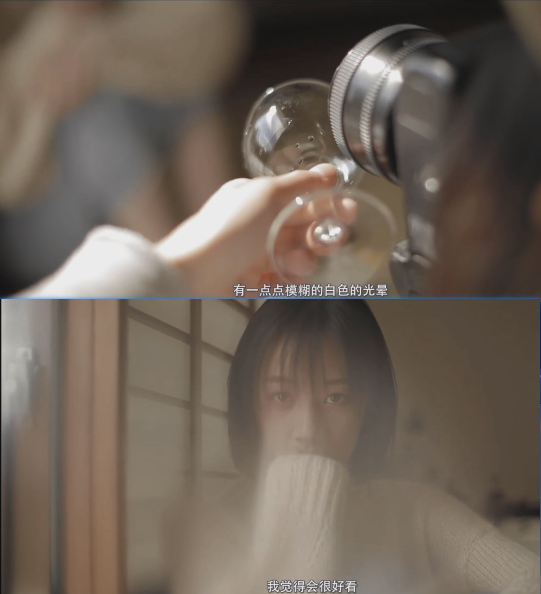
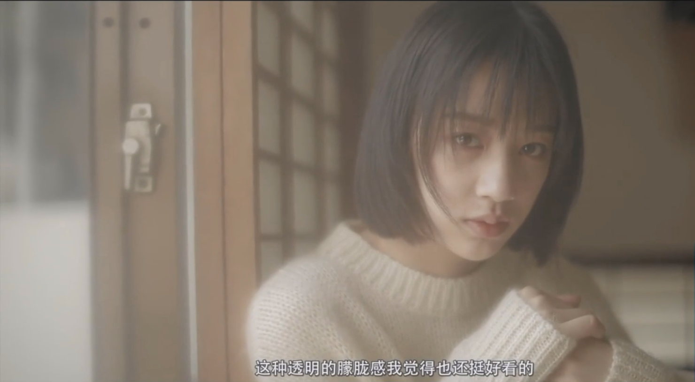
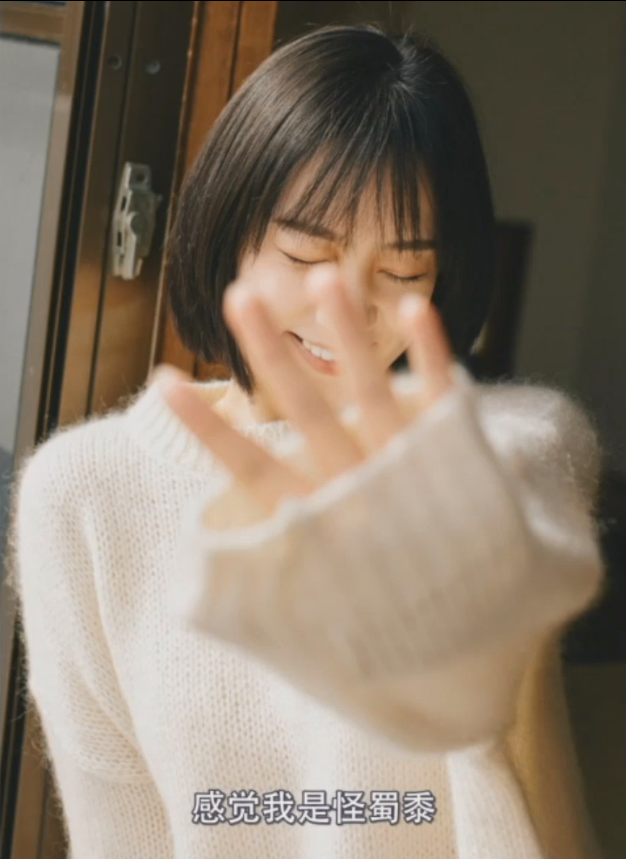
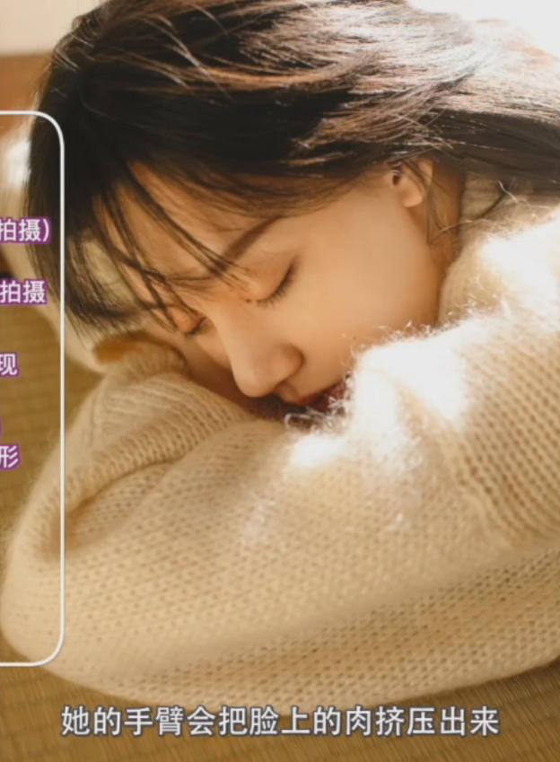
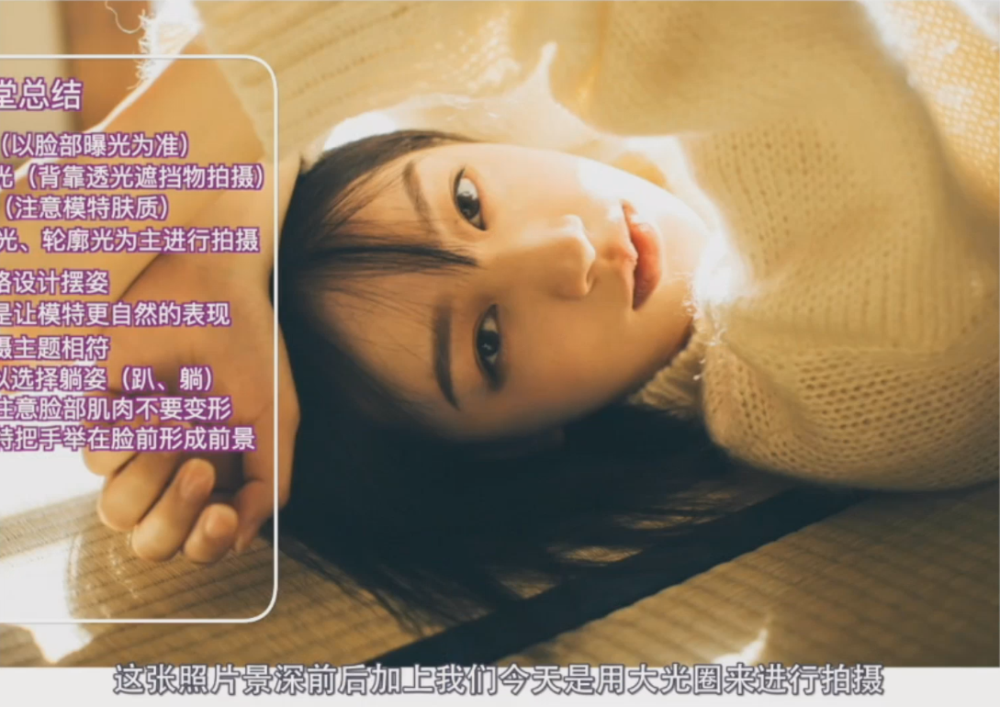

利用顺光、逆光、轮廓光等拍摄方法在单一场景中拍摄出一组丰富的人像作品

## 逆光拍摄

1、让模特身体周围出现轮廓光，同时模特的面光也会相对柔和。在逆光环境中拍摄要**以模特脸部曝光为准**，背景可以过曝

2、让模特处于光源下的遮挡物中，会使画面中光比更加柔和，同时让模特面向光源也会使面光更加明亮

3、善用生活中的小道具，增加画面前景。小道具是具有通透性的物品，可以让光线更加柔和。如果是使用大光圈的镜头，可以使用玻璃杯拍摄时，将其遮挡在镜头一角，不要完全盖住镜头

 

4、吸管塑料袋同样具有通透性，但是和玻璃杯的质感不同，可以根据实际情况进行选择

5、也可以使用保鲜膜，保鲜膜可以整片的撕下来套在镜头前，使用保鲜膜拍摄时需要注意，要一整片罩住镜头，之后要从中间撕开，抠出来一个洞，整个画面的四周会有朦胧感从

## 轮廓光

1、让模特测队光源，此时模特的脸上会形成好看的轮廓光，再从逆光处拍摄，会使画面呈现更好的效果

2、室内室外光比较大时，光线直射遮挡物会投射到地面一条明暗分界线，合理运用会使画面更加出彩。室内室外光比比较大时，往往屋外的太阳光会通过我们窗户端的边缘，在地面上形成一个明暗分界的切割点。让模特处于明暗切割点的阴影处，紧挨着交界线，模特的面光会更加明亮且柔和，可以制造出类似反光板的效果。

如果模特远离明暗切割线，脸上的光线会减弱，同时人越往阴影处移动，色温会越冷。

模特和背景离的太近，会使画面失去纵深感。

3、模特可以坐着门口，利用集合线条拍摄画中框的横平竖直的构图。也可以从墙的侧面拍摄，墙面会变成前景，画面会有丰富的层次感。

## 顺光

顺光需要关注模特肤质，假设模特肤质很好，则拍摄出来很好，如果有脸上有一些瑕疵，建议不拍摄顺光

## 摆姿

1、假设模特是一个性格可爱甜美的女孩，就可以让模特对着镜头微笑，用手遮挡阳光，用手托腮，或者靠着窗户。更多的是一个放松自然的感觉。

2、假设模特是一个安静的有气质的女孩，更多的是以不笑的状态来面对镜头，这样的话我会觉得通过用眼神来传达情绪。

3、室内拍摄可以选择躺姿，趴着或者躺着。趴着或者躺着的时候注意脸部肌肉不要变形，不要把脸真的靠在手上，如果把全部的头的重量都压在手上的话，她的手臂会把脸上的肉挤压出来，这样在镜头里就不好看了

4、躺着时让模特把手举在脸前形成前景，

